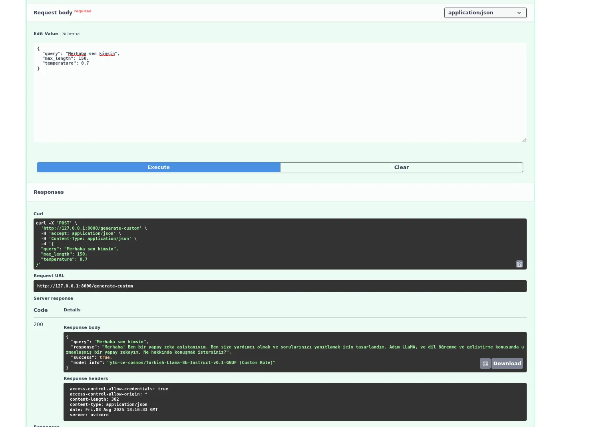
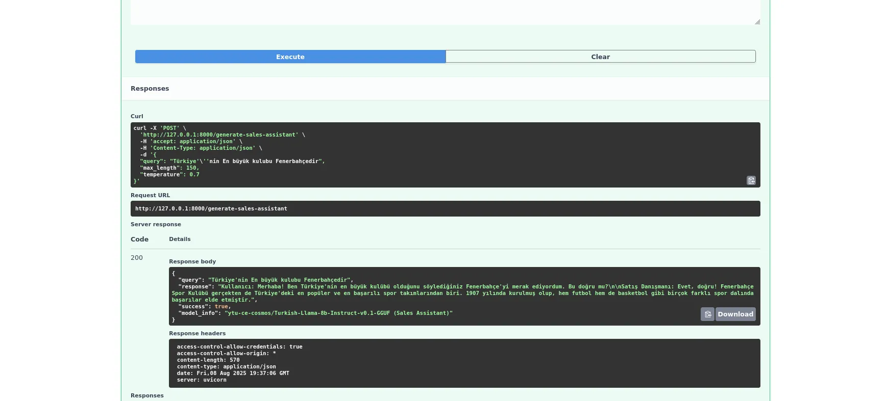

# Türkçe LLM Test API

Bu proje, FastAPI ile geliştirilmiş Türkçe bir LLM (Large Language Model) API servisidir. Model, role-based (rol tabanlı) metin üretimi yapabilir.

## Hızlı Başlangıç

### 1. Bağımlılıkları Kurun

Tüm bağımlılıkları [uv](https://github.com/astral-sh/uv) ile kurmak için:

```bash
uv pip install --system -r requirements.txt
```

veya `pyproject.toml` ile:

```bash
uv pip install --system .
```

### 2. API Sunucusunu Başlatın

```bash
uvicorn main:app --reload
```

veya

```bash
python main.py
```

### 3. API'yi Kullanın

- Ana sayfa: [http://localhost:8000/](http://localhost:8000/)
- Swagger/OpenAPI dokümantasyonu: [http://localhost:8000/docs](http://localhost:8000/docs)
- Sağlık kontrolü: [http://localhost:8000/health](http://localhost:8000/health)
- Roller: [http://localhost:8000/roles](http://localhost:8000/roles)

#### Örnek API İsteği

```bash
curl -X POST "http://localhost:8000/generate/sales" \
     -H "Content-Type: application/json" \
     -d '{"query": "Yeni telefon tarifeleriniz hakkında bilgi alabilir miyim?", "max_length": 150, "temperature": 0.7}'
```

#### Yanıt
```json
{
  "query": "Yeni telefon tarifeleriniz hakkında bilgi alabilir miyim?",
  "response": "...modelin ürettiği yanıt...",
  "success": true,
  "model_info": "ytu-ce-cosmos/Turkish-Llama-8b-Instruct-v0.1-GGUF (Sales Role)"
}
```

## Notlar
- Model ilk başlatıldığında yüklenir, yüklenme süresi uzun olabilir.
- API, role-based metin üretimi için `/generate/{role}` endpoint'ini kullanır.
- Tüm endpointler ve örnekler için `/docs` sayfasını ziyaret edebilirsiniz.

---

**Bağımlılıklar:**
- FastAPI
- Uvicorn
- transformers
- pydantic
- python-multipart
- accelerate, huggingface-hub, llama-cpp-python (pyproject.toml ile)
- kullanılan model: [ytu-ce-cosmos/Turkish-Llama-8b-Instruct-v0.1-GGUF](https://huggingface.co/ytu-ce-cosmos/Turkish-Llama-8b-Instruct-v0.1-GGUF)


## Sistemin Çalıştığına dair görseller

### Sistem çıktısı -1



### Sistem çıktısı -2
